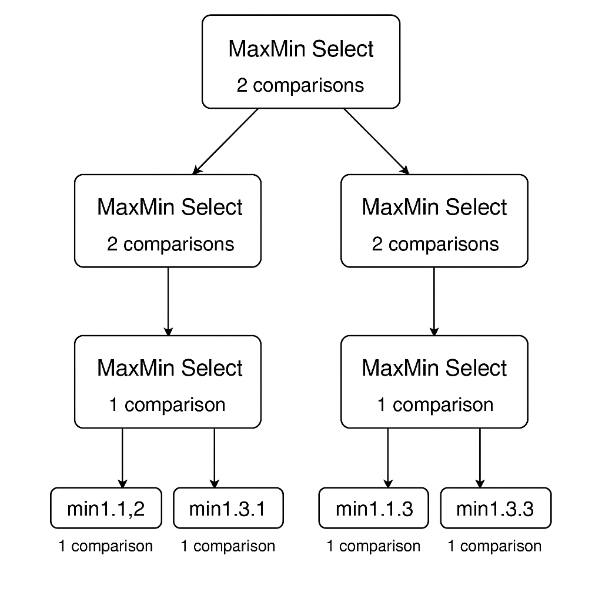

# Projeto Algoritmo MaxMin Select (FPAA)

## 📖 O que é este projeto?
Este projeto implementa o **Algoritmo de Seleção Simultânea do Menor e do Maior Elemento (MaxMin Select)** em Python.  
O trabalho faz parte da disciplina **Fundamentos de Projeto e Análise de Algoritmos (FPAA)** e inclui a implementação em código, análise de complexidade assintótica (contagem de operações + Teorema Mestre).

---

## 🧮 O que é o Algoritmo de Karatsuba?
O **MaxMin Select** é um algoritmo de **divisão e conquista (divide and conquer)** que encontra **simultaneamente** o menor e o maior elemento de uma sequência de números.  

🔑 Principais pontos:
- Reduz o número de comparações de **2(n−1)** (método ingênuo) para cerca de **1,5n**.  
- Divide o problema em subproblemas menores.  
- Combina resultados com apenas **2 comparações adicionais** por nível da recursão.

---

## ▶️ Como executar o projeto

### Pré-requisitos
- **Python 3.9+** instalado.  
- Este projeto **não** possui dependências externas.  

### 1) Clonar o repositório
git clone https://github.com/<bruna-bernardes>/maxmin-python.git

cd maxmin-python

### 2) (Opcional) Criar e ativar um ambiente virtual
- Windows

python -m venv .venv
.venv\Scripts\activate

- Linus/macOS

python3 -m venv .venv
source .venv/bin/activate

### 3) Executar o programa
- Windows

python main.py

- Linux/macOS

python3 main.py

### 4) Exemplo de saída
Informe os números separados por espaço: 1.1 1,2 55,3 10 5 6 

Menor = 1.1

Maior = 55.3

Comparações = 8

### Observações:
Se um número for inteiro (5.0), será exibido como 5.
Aceita vírgula ou ponto como separador decimal (ex.: 3,5 ou 3.5).

---

## ⚙️ Complexidade Ciclomática
A **complexidade ciclomática** é uma métrica que quantifica quantos caminhos independentes existem no código.

Para a função `maxmin_recursivo`, temos:
- **Nós (N):** 7  
- **Arestas (E):** 8  
- **Componentes (P):** 1

📌 Fórmula:  
\[
M = E - N + 2P = 8 - 7 + 2(1) = 3
\]

⚠️ Quanto maior o valor da complexidade ciclomática, mais difícil é entender e manter o código.  
👉 Nesse caso, a complexidade é **3**, considerada baixa.

---

## 🕸️ Fluxograma do Algoritmo MaxMin:

---

## 📊 Complexidade Assintótica
▶️ Pela contagem de operações

- Caso base com 1 elemento: 0 comparações.
- Caso base com 2 elementos: 1 comparação.
- Passo recursivo:
  C(n)=C(⌈n/2⌉)+C(⌊n/2⌋)+2

Para 𝑛=2𝑘:
C(n)=3/2​n−2

Geral:
C(n)≤⌈3/2n​⌉−2

📌 Comparações ≈ 1,5n → Melhor que o ingênuo (2n−2).

Complexidade temporal: O(n).

▶️ Pelo Teorema Mestre

- Recorrência de tempo:
  
T(n)=2T(n/2​)+O(1)

a=2, b=2, f(n)=Θ(1)

logb^​a=log2^​2=1

Como f(n)=O(n1−ε), aplica-se o Caso 1 do Teorema Mestre.

Solução:

T(n)=Θ(n)

📌 Confirma o crescimento linear.

---

## 📝 Explicação do Código

### 1. maxmin_recursivo
Caso com 1 elemento → menor = maior, 0 comparações.

Caso com 2 elementos → 1 comparação decide ambos.

Divide em duas metades → resolve recursivamente.

Combina resultados com 2 comparações (um min e um max).

### 2. maxmin
Interface principal.

Valida que a lista não está vazia.

Chama o método recursivo no intervalo inteiro.

### 3. converter_entrada
Transforma valores de entrada em int ou float.

Aceita ponto ou vírgula para decimais.

### 4. formata_num
Exibe como inteiro (5) se não houver parte decimal.

Caso contrário mantém float (3.5).

---

## 📦 Dependências

### Python 3.11.9 (sem bibliotecas externas).

---

## 📚 Documentação e Links úteis
https://www.geeksforgeeks.org/maximum-and-minimum-in-an-array

https://www.programiz.com/dsa/divide-and-conquer?

---

## ✅ Conclusão
O MaxMin Select é um exemplo clássico de divisão e conquista.
Ele encontra o menor e o maior elemento com apenas ~1,5 comparações por elemento, garantindo tempo O(n).
Na prática, é mais eficiente do que a abordagem ingênua, principalmente para grandes entradas.

